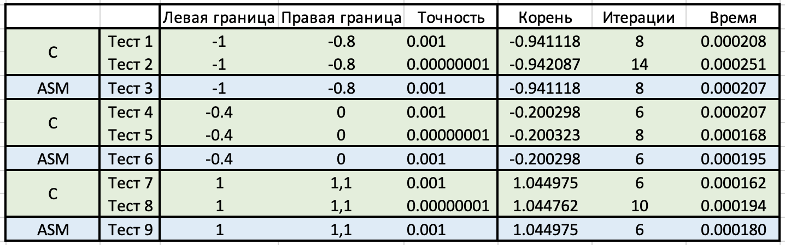

# HW_3
## Шаповалов Артём Сергеевич | БПИ-217 | Вариант 37

### Задание 3. Арифметика с плавающей точкой | Вариант 37
Разработать программу, определяющую корень уравнения методом хорд с точностью от 0,001 до 0,00000001 в диапазоне [-1;1.1]. Если диапазон некорректен, то подобрать корректный диапазон.

### Решение на 8 баллов:

Код программы на С - [8.c](8.c), в котором соблюденые следующие требования:
- В программе на языке C необходимо использовать функции с передачей данных через формальные параметры.
- Внутри функций необходимо использовать локальные переменные, которые при компиляции отображаются на стек.
- Исходные данные и формируемые результаты должны вводиться и выводиться через файлы. Имена файлов задаются с использованием аргументов командной строки. Ввод данных в программу с клавиатуры и вывод их на дисплей не нужен. За исключением сообщений об ошибках.
- Командная строка проверяется на корректность числа аргументов. В программе должна присутствовать проверка на корректное открытие файлов. При наличии ошибок должны выводиться соответствующие сообщения.
- Включение в программы функций, обеспечивающих замеры времени для проведения сравнения на производительность. Необходимо добавить замеры во времени, которые не учитывают время ввода и вывода данных.
```
#include <stdio.h>
#include <stdlib.h>
#include <math.h>
#include <string.h>
#include <time.h>
#define MAX_I 100000
 
 
static int count=0;
 
double f (double x){
    count++;
    return x*x*x*x*x-x-0.2;
}

int chord_method (double (*f)(double), double a, double b, double eps, double *x){
    double fa, fb;
    int i;
    for (i=0; i < MAX_I; i++){
            if (fabs(b - a) < eps) break;
            fa = f(a); fb = f(b);
            a = b - (b-a)*fb / (fb - fa);
            b = a - (a-b)*fa / (fa - fb);
        }
    if (i < MAX_I){
            *x = b;
            return count;
        }
    return -1;
}
 
int main(int argc, char *argv[]) {
  if((argc != 2) && (argc != 4)&& (argc != 3)){
    printf("Incorrect input, check README.md\n");
    return 0;
  }
  clock_t start, end;
  if(strcmp(argv[1], "-h") == 0){
    printf("\n-h help\n");
    printf("-f use numbers from first file and save result in second file\n");
    printf("-s take numbers from terminal and print result in file\n");
  }
  else if(strcmp(argv[1], "-f") == 0){
    if(argc != 4){
      printf("Incorrect input, check README.md\n");
      return 0;
    }
    FILE *input = fopen(argv[2], "r");
    FILE *out = fopen(argv[3], "w");
    if((input == NULL) || (out == NULL)){
      printf("incorrect file\n");
      return 0;
    }
    double a, b, eps, x;
    start = clock(); 
    fscanf(input, "%lf", &a);
    fscanf(input, "%lf", &b);
    fscanf(input, "%lf", &eps);
    if ( chord_method(f, a, b, eps, &x) > 0 ) fprintf(out, "Root: %lf\nIterations: %d\n", x, count);
    else fprintf(out, "I cant find root:(\n");
    end = clock();
    double t = (double)(end-start)/(CLOCKS_PER_SEC);
    fprintf(out, "time: %.6lf\n",t);
    fclose(input);
    fclose(out);
  }
  else if((strcmp(argv[1], "-s") == 0)){
    if(argc != 3){
      printf("Incorrect input, check README.md\n");
      return 0;
    }
    FILE *out = fopen(argv[2], "w");
    if((out == NULL)){
      printf("incorrect file\n");
      return 0;
    }
    double a, b, eps, x;
    start = clock(); 
    scanf("%lf", &a);
    scanf("%lf", &b);
    scanf("%lf", &eps);
    if ( chord_method(f, a, b, eps, &x) > 0 ) fprintf(out, "Root: %lf\nIterations: %d\n", x, count);
    else fprintf(out, "I cant find root:(\n");
    end = clock();
    double t = (double)(end-start)/(CLOCKS_PER_SEC);
    fprintf(out, "time: %.6lf\n", t);
    fclose(out);
  }
  return 0;
}
```

Решение на 8 баллов на ассемблере с соответствующими комментариями - [8.s](8.s)

Код разделённый на два файла (6 баллов) - [8-1.s](8-1.s) и [8-2.s](8-2.s)

В программу добавлены ввод данных из файла и вывод результатов в файл:
- [input.txt](input.txt) - Входные данные
- [output.txt](output.txt) - Выходные данные

В данном варианте задания нет смысла использовать генерацию случайных наборов данных, поэтому ее здесь нет. Данный вопрос был обсужден с Сергеем Александровичем Видениным.

Решение на 8 баллов на ассемблере после рефакторинга, для проведения сравнения на производительность - [8-ref.s](8-ref.s) 
+ [8-ref.s](8-ref.s) - 7 731 Б (8 КБ на диске)
+ [8.s](8.s) - 8 264 Б (12 КБ на диске)

Ключи:
- -h help (вывод всех ключей с обозначениями)
- -f input.txt output.txt (ввод из входного файла и запись результата в выходной файл)
- -s (ввод из командной строки)


В следующей таблице приведено тестовое покрытие и результаты работы программ (полученные временные данные):
<br></br>


